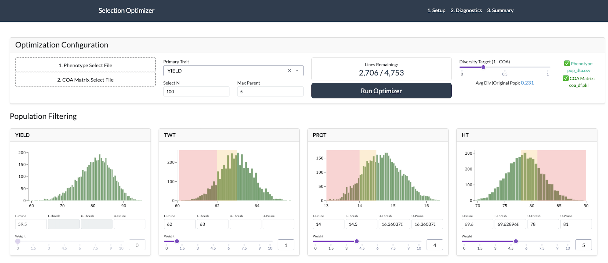
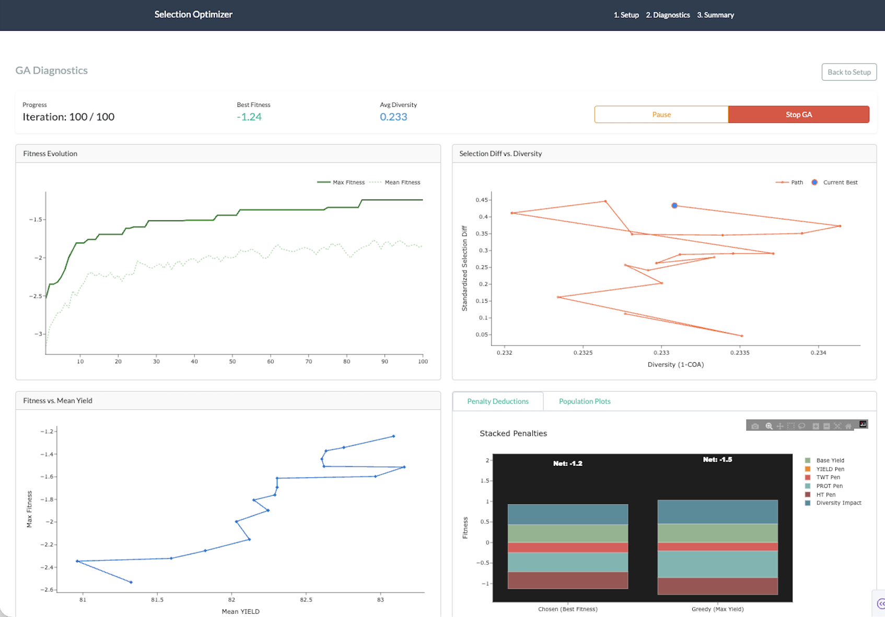
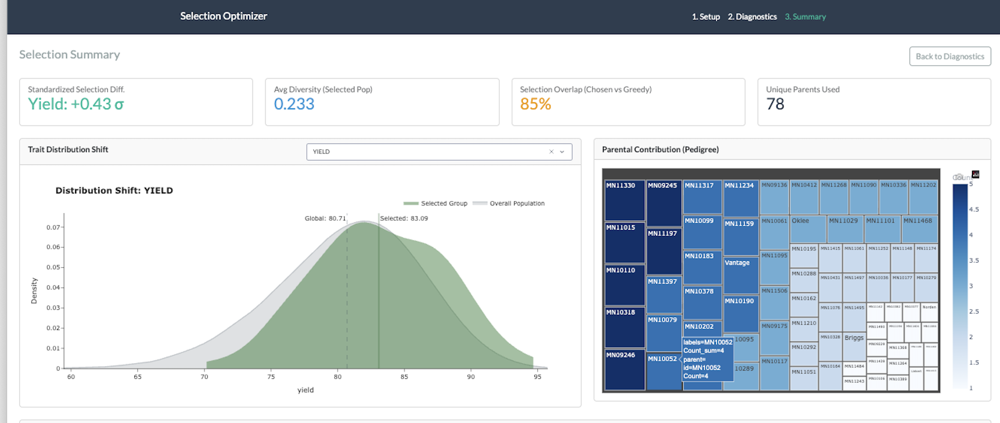
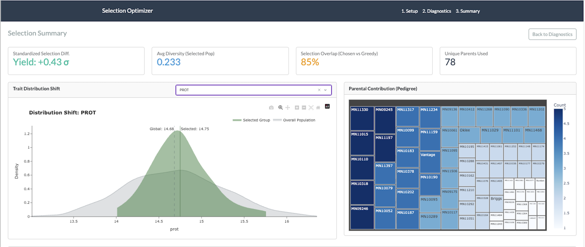
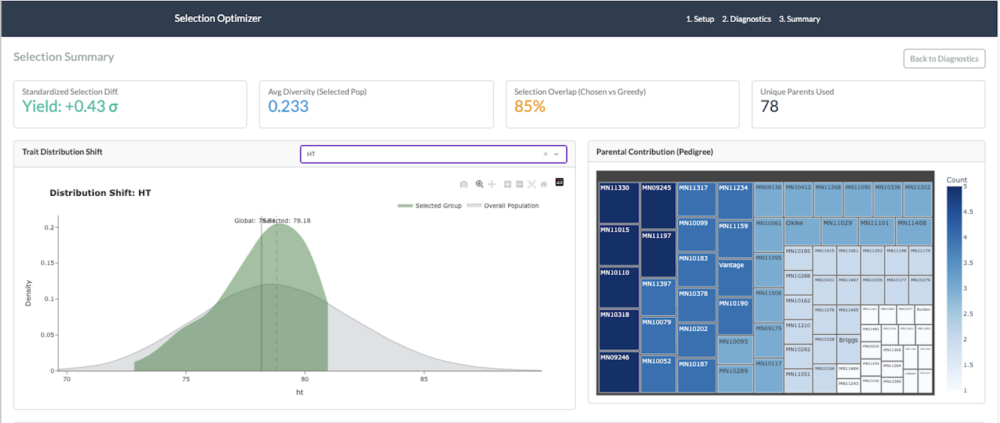

## Multi-Objective Optimization Dashboard

An interactive Dash application for solving subset selection problems using a custom Genetic Algorithm (GA). This tool automates the process of identifying the optimal group of individuals from thousands of potential candidates while balancing multiple competing constraints.

### Overview
In many fields—from finance to genomics—selecting an optimal subset is a combinatorial challenge. This project provides a decision-support engine that searches a vast solution space to maximize a primary objective while preserving group health (secondary traits), diversity, and parental limits.

### Optimization Logic (The Fitness Function)
The core of the GA is a weighted fitness function that calculates a fitness score for every potential solution. The algorithm seeks to maximize:

**Fitness = Mean(Primary) - Σ(Deviation_trait × w_trait) - (nᵀGn × [δ + γ] × w_div)**

### 1. Directional Selection
The algorithm prioritizes the maximization of the Primary Trait mean within the selected group.

### 2. Constraint Handling (Secondary Traits)
Users can define thresholds for any number of secondary variables. Solutions that fall outside these boundaries incur a scaled penalty, forcing the algorithm to seek feasible regions of the search space.

### 3. Diversity & Parental Use
To prevent "homogeneity bias" (where the model picks too many similar individuals), the system calculates:
* Diversity Penalty: Based on the relationship/covariance matrix of the subset.
* Overuse Penalty: Based on the standard deviation of source frequency, ensuring no single "parent" or source is over-represented.

### Key Features
* Interactive Dashboard: Built with Plotly Dash, allowing for real-time adjustments of weights and thresholds.
* Data Normalization: Automatic Z-score normalization of numeric traits to ensure consistent mathematical weighting.
* Vectorized Computation: Optimized with NumPy for high-performance generation processing.

### Tech Stack
* Language: Python
* Framework: Plotly Dash (Frontend), Flask (Backend)
* Libraries: NumPy, Matplotlib, Plotly, Pandas, Scipy, PyGAD
* Algorithm: Custom Heuristic Genetic Algorithm

### How to Run
1. Clone the repository.
2. Install dependencies: `pip install -r requirements.txt`
3. Run the app: `python app.py`
4. Access the dashboard at `http://127.0.0.1:8050/`
